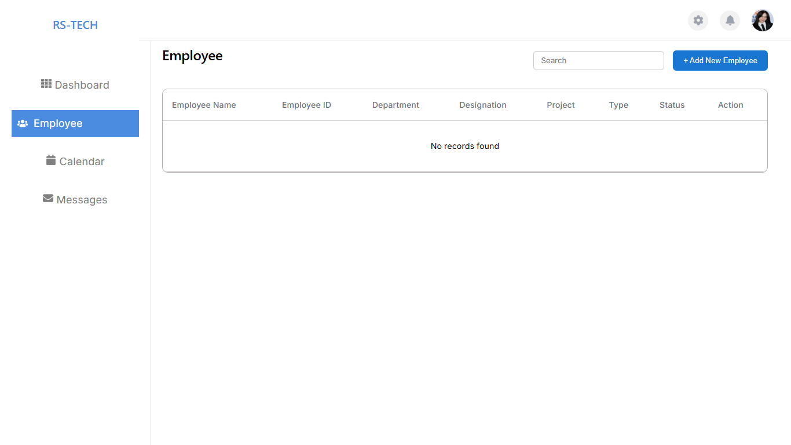
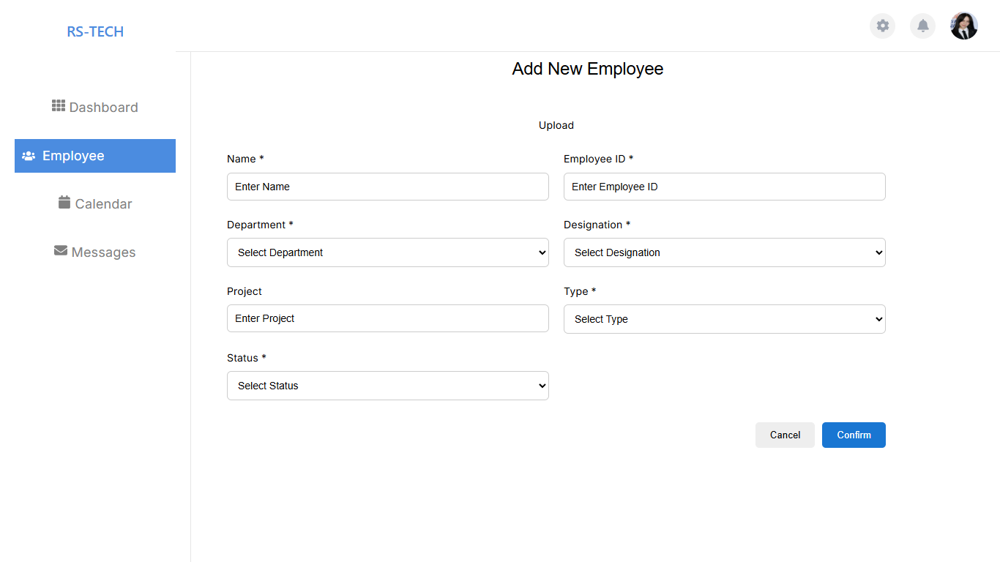
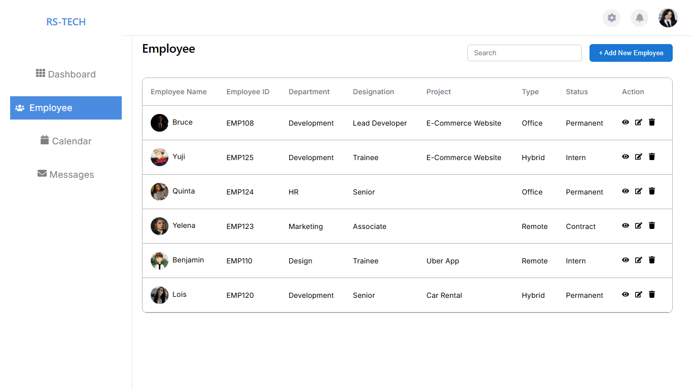
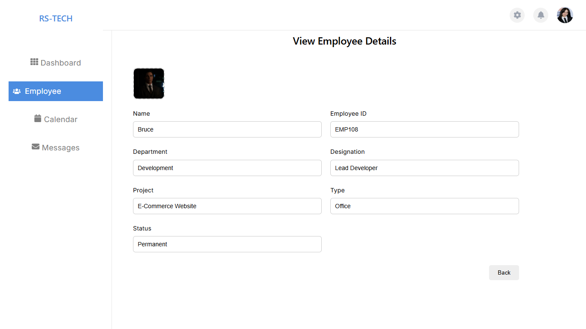
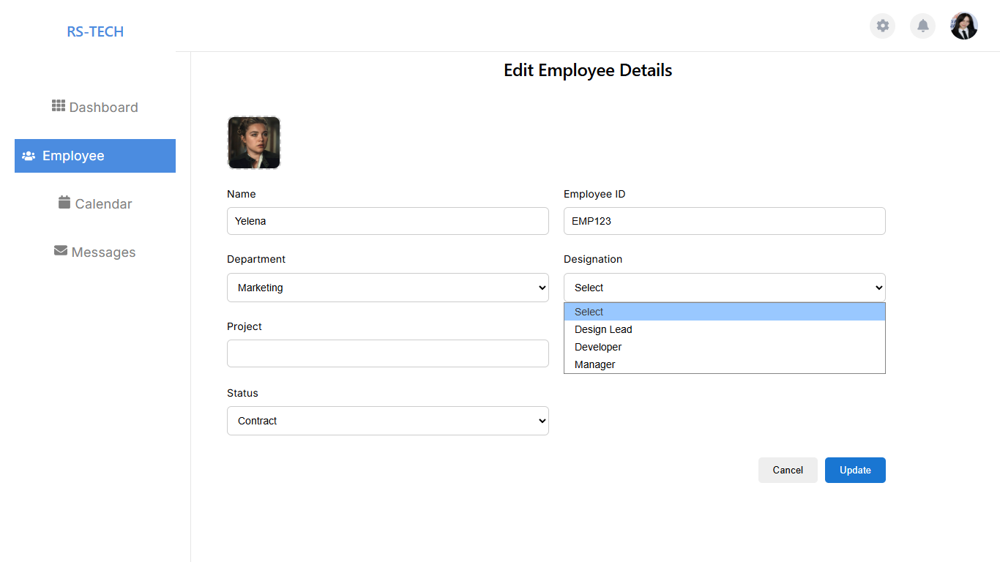
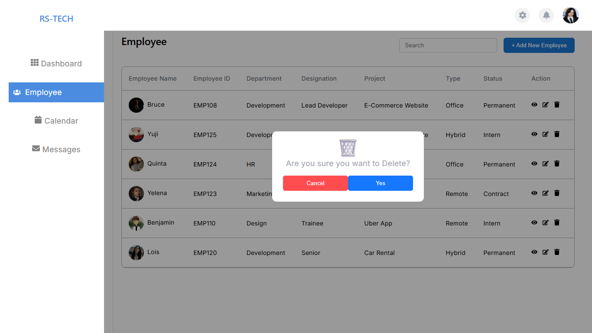

#  Employee Management System

## 📌 Description
A MERN Stack Employee Management System built using React, Node.js, Express, and MySQL. This application allows users to manage employee data with features like adding, viewing, updating, deleting, and uploading profile images.

## ⚙️ Tech Stack
- Frontend: React.js, CSS, Axios
- Backend: Node.js, Express.js
- Database: MySQL

## ✨ Features
- Add new employee  
- View employee details  
- Update employee information  
- Delete employee  
- Upload and display profile images  
- Search employees  
- Clean dashboard UI  

## 📂 Project Structure

```
employee-management-system/
│
├── backend/
│   ├── config/
│   ├── routes/
│   ├── uploads/
│   ├── app.js
│   ├── server.js
│   ├── db.js
│   └── .env
│
├── frontend/
│   ├── src/
│   ├── public/
│   └── package.json
│
├── .gitignore
└── README.md
```
## 📋 Requirements

Make sure the following are installed on your system:

- Node.js (v16 or above)  
- npm (comes with Node.js)  
- MySQL Server  
- MySQL Workbench (or any MySQL client)  

---

## ▶️ How to Run the Project

Follow these steps in order:

---

### 1️⃣ Database Setup (First Step)

- Open MySQL

- Create the database:

```sql
CREATE DATABASE employee_db;
```

- Import the provided SQL file:
 backend/database.sql

👉 This file contains the table structure required for the project.

---

### 2️⃣ Backend Setup

- Open terminal and go to backend folder:

```bash
cd backend
```

- Install dependencies:

```bash
npm install
```

- Create a `.env` file inside backend:

```env
PORT=5000
DB_HOST=localhost
DB_USER=root
DB_PASSWORD=your_password
DB_NAME=employee_db
```

- Start the backend server:

```bash
npm run dev
```

👉 You should see:

```text
MySQL Connected!
Server running on port 5000
```

---
### 3️⃣ Frontend Setup

- Open a new terminal and go to frontend folder:

```bash
cd frontend
```

- Install dependencies:

```bash
npm install
```

- Start the frontend:

```bash
npm run dev
```

---
### ✅ Final Step

- Open browser and go to:

```text
http://localhost:5173
```

👉 Now the application will be running.

### ⚠️ Important Notes

- Make sure backend is running before starting frontend  
- Ensure `uploads` folder exists inside backend  
- Database must be created before running backend  
---
## 📸 Screenshots

### Empty List:

---
### Adding New Employee:

---
### Employee List:

---
### Viewing Employee:

---
### Updating:

---
### Deleting Employee:


---